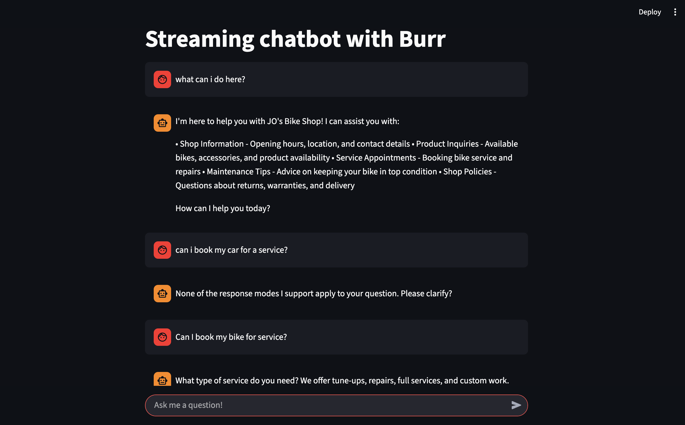
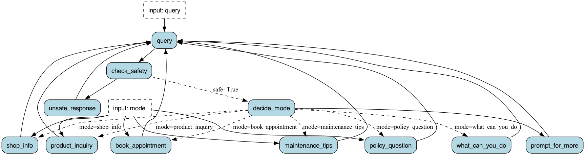
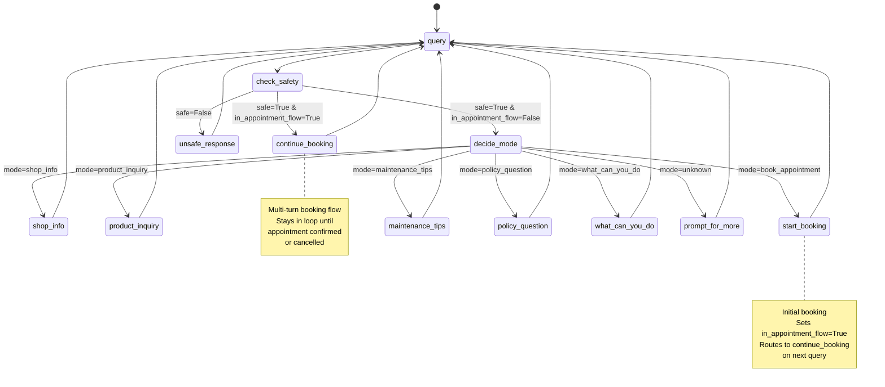

# JO's Bike Shop Chatbot

A sophisticated multi-turn conversational AI chatbot built with Burr and OpenAI, designed to handle customer inquiries for a bicycle shop. This application demonstrates advanced state management, intelligent conversation flows, and real-time streaming responses.

Built as a realistic example of a multi-turn chatbot for evaluation and demonstration purposes, based on the [Streaming API example in the Burr repository](https://github.com/apache/burr/tree/main/examples/streaming-fastapi).

## 📊 NEW: Conversation Extraction & Evaluation Tools

Extract conversation data from Burr tracking files for multi-turn evaluation:

- **`extract_conversations.py`**: Command-line tool to extract conversations from Burr LocalTrackingClient storage
- **`conversation_extraction.ipynb`**: Interactive Jupyter notebook for exploration and analysis
- **`evaluation_helpers.py`**: Helper functions for preparing data for evaluation frameworks
- **`example_extraction.py`**: Complete example demonstrating the extraction workflow

See [CONVERSATION_EXTRACTION_GUIDE.md](CONVERSATION_EXTRACTION_GUIDE.md) for detailed usage instructions.

## [Streamlit](https://streamlit.io/) frontend (choose your own UI)



## Application state machine diagram:



## Features

### 🤖 Intelligent Mode Detection
- **LLM-Powered Classification**: Uses GPT-4o to automatically detect customer intent and route to appropriate handlers
- **Context-Aware**: Understands customer queries in natural language without requiring specific keywords
- **Multi-Modal Support**: Handles seven different conversation modes seamlessly

### 🏪 Comprehensive Shop Information
Built-in knowledge base with complete shop details:
- **Location**: 456 Pedal Lane, Portland, OR 97201
- **Hours**: Open 7 days a week (Mon-Fri 9AM-6PM, extended Thu-Fri until 7PM, Sat 8AM-5PM, Sun 10AM-4PM)
- **Services**: Tune-ups ($75), Full Service ($150), Custom Builds ($500+), and specialized repairs
- **Specialties**: Bike fitting, race team support, e-bike service, custom frame building, vintage restoration
- **Contact**: (503) 555-BIKE, info@josbikeshop.com

### 📅 Advanced Multi-Turn Appointment Booking
Intelligent conversation flow that adapts to customer input:

- **Dual-Flow Support**: 
  - **Single-Turn**: Processes all information provided upfront
  - **Multi-Turn**: Progressively collects missing details through natural conversation

- **Smart Information Extraction**: Uses GPT-4o to extract appointment details from natural language
  - Required fields: service type, preferred date, preferred time
  - Optional fields: bike details, specific issues, contact information

- **Intelligent Confirmation Handling**: LLM-based response classification
  - Detects affirmative responses ("yes", "looks good", "book it")
  - Handles negative responses ("no", "that's wrong", "cancel")
  - Recognizes change requests ("update the time", "different date")

- **Focus Management**:
  - Detects off-topic queries during booking
  - Gently redirects customers to complete appointment
  - Supports explicit cancellation ("cancel", "nevermind", "forget it")

### 🛡️ Additional Capabilities
- **Product Inquiries**: Information about bikes, accessories, and availability
- **Maintenance Tips**: Expert advice on bike care and maintenance
- **Policy Questions**: Answers about returns, warranties, and delivery
- **Safety Filtering**: Basic content moderation
- **Capability Explanation**: Helps users understand what the chatbot can do

## Architecture

### Technology Stack
- **State Machine**: Burr framework for robust state management and workflow orchestration
- **LLM Models**:
  - GPT-4o for intent detection, information extraction, and response classification
  - GPT-3.5-turbo for conversational responses
- **Streaming**: Async generators for real-time response streaming
- **APIs**: FastAPI server with Server-Sent Events (SSE)
- **UI**: Streamlit for interactive demonstration

### State Management
The application maintains conversation state across turns:
- `chat_history`: Complete conversation history
- `appointment_data`: Collected appointment information
- `in_appointment_flow`: Boolean flag indicating active booking session
- `awaiting_confirmation`: Boolean flag for confirmation state

State is preserved across conversation turns using selective field retention, ensuring appointment data persists while other state is refreshed.

## Prerequisites

- Python 3.8 or higher
- OpenAI API key
- Dependencies listed in `requirements.txt`

## Installation

1. **Clone the repository**
```bash
git clone <repository-url>
cd multi_turn_chatbot_eval
```

2. **Create and activate a virtual environment**
```bash
# Create virtual environment
python -m venv .venv

# Activate on macOS/Linux
source .venv/bin/activate

# Activate on Windows
.venv\Scripts\activate
```

3. **Install dependencies**
```bash
pip install -r requirements.txt
```

4. **Set up environment variables**

Create a `.env` file in the project root:
```bash
OPENAI_API_KEY=your_openai_api_key_here
```

## Running the Application

### Option 1: Streamlit UI (Recommended for Quick Start)
```bash
streamlit run streamlit_app.py
```
Opens an interactive web interface at `http://localhost:8501`

### Option 2: FastAPI Server
```bash
uvicorn server:app --reload
```
Starts the API server at `http://localhost:8000`

### Option 3: Burr UI (Monitoring & Debugging)
```bash
burr
```
Opens the Burr monitoring interface at `http://localhost:7241` for viewing application traces and debugging.

### Option 4: Visualize State Machine
```bash
python application.py
```
Generates and displays the state machine diagram (`statemachine.png`)

## Application Structure

```
multi_turn_chatbot_eval/
├── application.py          # Core Burr application with state machine logic
├── server.py              # FastAPI server implementation
├── streamlit_app.py       # Streamlit UI for interactive demo
├── prd.md                 # Product requirements document
├── requirements.txt       # Python dependencies
├── statemachine.png       # Generated state machine visualization
└── README.md             # This file
```

### Key Files

- **`application.py`**: Contains all Burr actions, state machine graph, and business logic
  - State machine definition with transitions
  - Streaming actions for all conversation modes
  - Helper functions for appointment booking
  - Shop information constants

- **`server.py`**: FastAPI server with SSE streaming endpoints
  - Application instance management
  - Streaming response handlers
  - CORS configuration

- **`streamlit_app.py`**: Interactive UI for testing and demonstration
  - Chat interface
  - Conversation history display
  - State visualization

## How It Works

### Conversation Flow

1. **Query Processing**: Customer input is captured and chat history is updated
2. **Safety Check**: Basic content moderation filter
3. **Routing Decision**:
   - If `in_appointment_flow=True`: Route to `continue_booking` action
   - Otherwise: Use LLM to detect mode and route to appropriate action
4. **Action Execution**: Selected action processes query and generates response
5. **Response Streaming**: Response is streamed back to user in real-time
6. **Loop**: Return to query processing for next turn

### Appointment Booking Flow

#### Starting a Booking (`start_booking` action)
1. Extract all available information from initial query using LLM
2. Check which required fields are missing
3. **If complete**: Show confirmation immediately (single-turn flow)
4. **If incomplete**: Ask for first missing field and enter multi-turn flow
5. Set `in_appointment_flow=True` to maintain booking context

#### Continuing a Booking (`continue_booking` action)
1. **If awaiting confirmation**:
   - Use LLM to classify response (affirmative/negative/change)
   - Affirmative: Book appointment and exit flow
   - Negative: Cancel booking and exit flow
   - Change: Ask what to change and continue collecting

2. **Check for explicit cancellation**: Keywords like "cancel", "nevermind"
3. **Check for off-topic queries**: Redirect back to booking if customer strays
4. **Extract new information**: Process customer's response
5. **Update appointment data**: Merge new info with existing data
6. **Check completeness**:
   - Complete: Generate confirmation and wait for approval
   - Incomplete: Ask for next missing field

#### State Transitions



## Streaming Implementation

### Burr Streaming Actions

Actions are defined as async generators using the `@streaming_action` decorator:

```python
@streaming_action(reads=["query", "chat_history"], writes=["response"])
async def shop_info_response(state: State) -> AsyncGenerator[Tuple[dict, Optional[State]], None]:
    # Stream response word by word
    for word in response.split():
        await asyncio.sleep(0.05)
        yield {"delta": word + " "}, None
    
    # Final yield with complete result and updated state
    yield result, state.update(**result).append(chat_history=result["response"])
```

**Key Points**:
- Yields tuples of `(delta, state)`
- Intermediate yields have `state=None`
- Final yield includes updated state
- Enables real-time user feedback

### Integration with FastAPI

The FastAPI server bridges Burr's streaming with Server-Sent Events:

```python
async def sse_generator():
    async for item in streaming_container:
        yield f"data: {json.dumps({'type': 'delta', 'value': item['delta']})}\n\n"

return StreamingResponse(sse_generator())
```

This allows the frontend to receive updates in real-time as the LLM generates responses.

## Configuration

### Appointment Fields

**Required Fields** (must be collected before booking):
```python
APPOINTMENT_REQUIRED_FIELDS = [
    "service_type",      # tune-up, repair, full service, etc.
    "preferred_date",    # customer's preferred date
    "preferred_time",    # morning, afternoon, specific time
]
```

**Optional Fields** (collected if provided):
```python
APPOINTMENT_OPTIONAL_FIELDS = [
    "bike_details",      # make/model if available
    "specific_issues",   # any specific problems to address
    "contact_info",      # phone/email for confirmation
]
```

### Available Modes

The chatbot supports seven operational modes:
1. `shop_info` - Shop hours, location, contact, services
2. `product_inquiry` - Bikes, accessories, availability
3. `book_appointment` - Service appointment booking
4. `maintenance_tips` - Bike maintenance advice
5. `policy_question` - Returns, warranties, delivery
6. `what_can_you_do` - Chatbot capabilities
7. `unknown` - Fallback for unclear queries

### Shop Information

All shop details are centralized in the `SHOP_INFO` constant in `application.py`. Update this dictionary to modify shop information without changing code logic.

## State Management

### State Fields

- **`chat_history`**: List of all conversation messages (role, content, type)
- **`appointment_data`**: Dictionary of collected appointment information
- **`in_appointment_flow`**: Boolean indicating active appointment booking session
- **`awaiting_confirmation`**: Boolean indicating waiting for customer confirmation
- **`query`**: Current customer query
- **`mode`**: Detected conversation mode
- **`safe`**: Safety check result

### State Persistence

The `process_query` action uses selective state wiping:
```python
keep_fields = ["query", "chat_history", "in_appointment_flow", "appointment_data", "awaiting_confirmation"]
state.wipe(keep=keep_fields)
```

This ensures:
- Appointment data persists across conversation turns
- Booking state is maintained during multi-turn flows
- Temporary state (mode, response deltas) is cleared between queries

## Development

### Visualizing the State Machine

Generate and view the state machine diagram:
```bash
python application.py
```

This creates `statemachine.png` showing all states, actions, and transitions.

### Debugging with Burr UI

Run the Burr monitoring interface:
```bash
burr
```

Features:
- View all application traces
- Inspect state at each step
- Debug conversation flows
- Analyze performance metrics
- Compare different conversation paths

### Modifying Shop Information

Edit the `SHOP_INFO` dictionary in `application.py`:
```python
SHOP_INFO = {
    "name": "Your Shop Name",
    "address": {...},
    "contact": {...},
    "hours": {...},
    # ... etc
}
```

No code changes needed - the `shop_info_response` action automatically uses this data.

### Adding New Modes

1. Add mode name to `MODES` list
2. Update `choose_mode` action prompt with examples
3. Create action handler (or bind existing `chat_response`)
4. Add transition in graph builder
5. Add to `TERMINAL_ACTIONS` list

## References

- [Burr Documentation](https://burr.dagworks.io/)
- [Burr Streaming Actions Guide](https://burr.dagworks.io/concepts/streaming-actions/)
- [Original Streaming API Example](https://github.com/apache/burr/tree/main/examples/streaming-fastapi)
- [Blog Post: Streaming Chatbot with Burr & FastAPI](https://blog.dagworks.io/p/streaming-chatbot-with-burr-fastapi)
